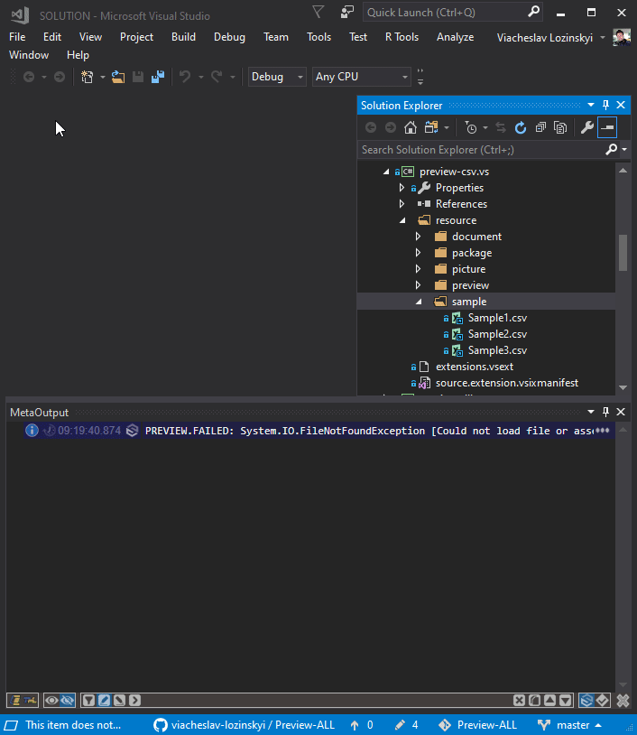

### Now you can look inside [CSV](https://en.wikipedia.org/wiki/Comma-separated_values), [DSV](https://en.wikipedia.org/wiki/Comma-separated_values) and [TSV](https://en.wikipedia.org/wiki/Comma-separated_values) files not opening it.
---

---
Download the extension from the [Visual Studio Marketplace](https://marketplace.visualstudio.com/items?itemName=ViacheslavLozinskyi.Preview-CSV)

---
Data visualization is based on [MetaProject](https://marketplace.visualstudio.com/items?itemName=ViacheslavLozinskyi.MetaProject)

Data extraction is based on [CSV](https://github.com/stevehansen/csv/)